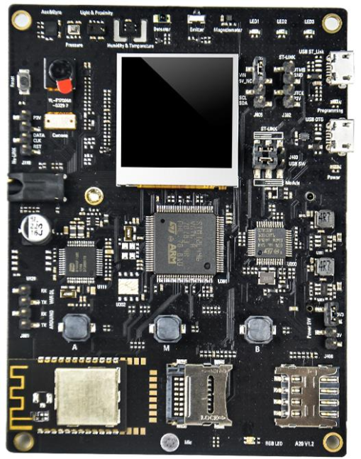

# Port TinyMaix to STM32L496
1M Flash 
320k RAM
80 Mhz

## Chip
|Item |Parameter|
|--   |--|
|Chip |STM32L496|
|Arch |ARM Cortex M4|
|Freq |80M |
|Flash|1024KB|
|RAM  |320KB|
|Acceleration| ARM SIMD|

## Board
alios development board STM32L496VGT6

## Development Environment
MDK 5.37

## Step/Project
Just simple edit tm_port.h...   

Porting Project in:   
https://github.com/Zepan/TinyMaix_STM32F411

## Result
|config  |mnist|cifar|vww96|mbnet128|Note|
|---     |---  |---  |---    |---     |---|
|O0 CPU  |2    |136  |490    |902     ||
|O1 CPU  |2    |120  |495    |798     ||
|O0 SIMD |2    |107  |368    |681     ||
|O1 SIMD |2    |75   |366    |558     ||

## Note
STM32F411 Flash is too small to place 96x96 image, use random data instead.  
O1 slow than O0 is beacuse Flash random read speed limit.   

## Author
zepan@sipeed.com# TinyMaix_STM32L496
# TinyMaix_STM32L496
